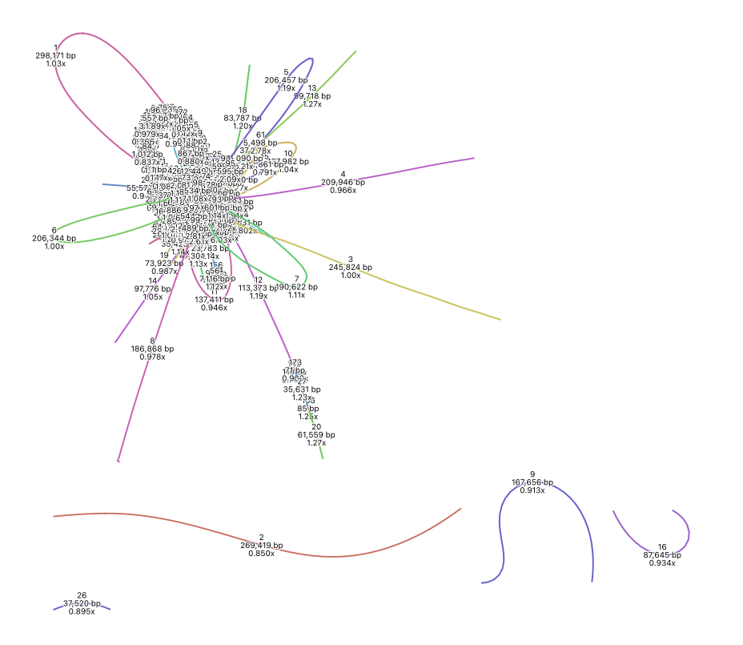
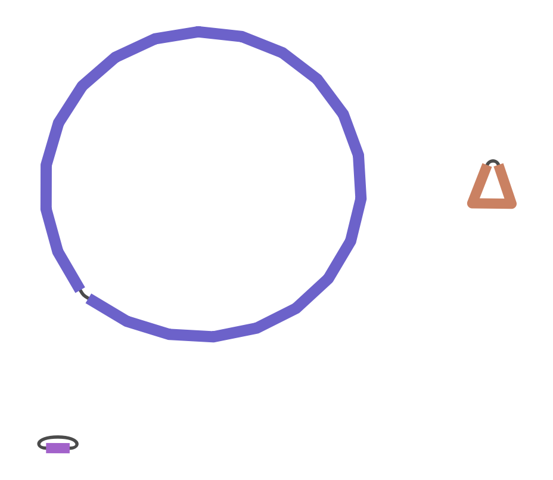
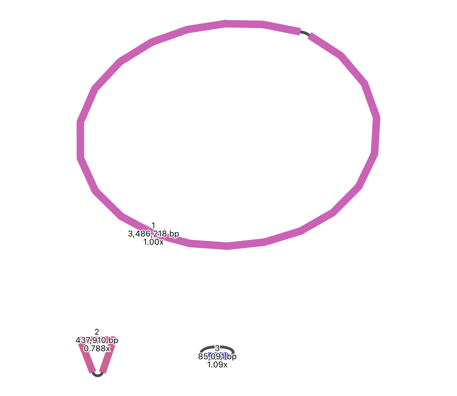
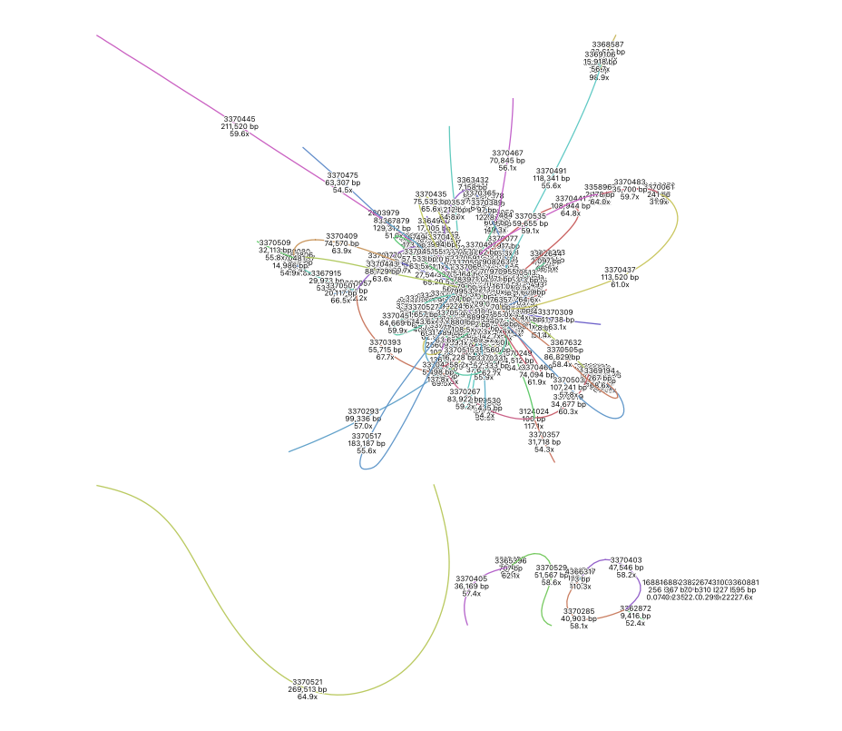
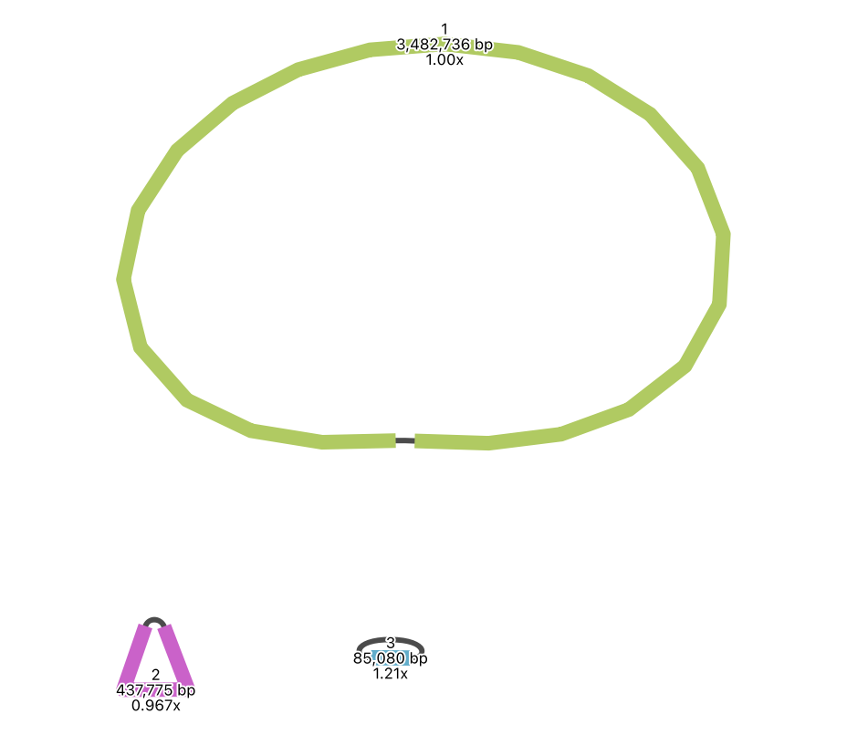
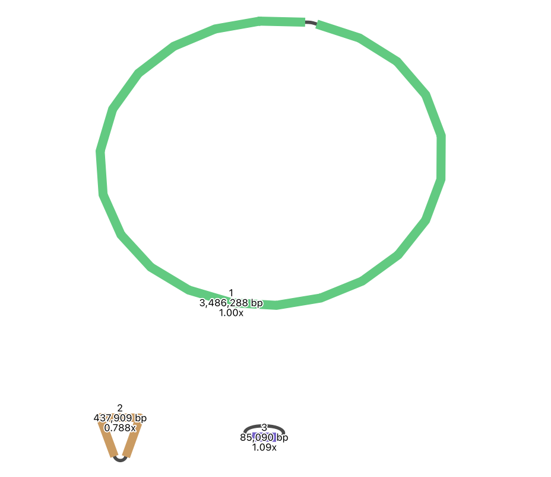

# Results Summary – Barcode01 & Barcode05

This file summarizes the genome assembly and annotation results for samples barcode01 and barcode05 across different sequencing strategies. Results include contiguity statistics (QUAST), gene annotation (Prokka), and visual inspection of assembly graphs (Bandage).

---

## Sample: Barcode01

### Illumina-only Assembly
- **Assembler:** Unicycler  
- **Contigs:** 154  
- **Total length:** 3,891,985 bp  
- **GC content:** 65.74%  
- **N50:** 167,656 bp  
- **L50:** 9  

**Prokka Annotation Summary:**  
- CDS: 3881  
- rRNA: 3  
- tRNA: 49  
- Repeat regions: 3  

**Bandage Graph Summary:**  
The graph is highly fragmented with no apparent circular contig. Over 300 contigs cluster in a tangled central region, indicating that Illumina-only data struggles to resolve full genomic structure.  

---

### Long-read Assembly
- **Assembler:** LRA + minimap2  
- **Contigs:** 3  
- **Total length:** 4,008,716 bp  
- **GC content:** 65.48%  
- **N50:** 3,485,407 bp  
- **L50:** 1  

**Prokka Annotation Summary:**  
- CDS: 4252  
- rRNA: 6  
- tRNA: 55  
- Repeat regions: 3  

**Bandage Graph Summary:**  
A clean and simple graph with a single large circular contig and two small unconnected ones. This reflects a high-contiguity assembly with likely full chromosomal recovery.  

---

### Hybrid Assembly
- **Assembler:** Unicycler  
- **Contigs:** 3  
- **Total length:** 4,009,219 bp  
- **GC content:** 65.49%  
- **N50:** 3,486,218 bp  
- **L50:** 1  

**Prokka Annotation Summary:**  
- CDS: 4007  
- rRNA: 6  
- tRNA: 55  
- Repeat regions: 3  

**Bandage Graph Summary:**  
Graph structure nearly identical to the long-read assembly, confirming that hybrid sequencing provides strong structural accuracy. All three contigs are clearly resolved.  

---

## Sample: Barcode05

### Illumina-only Assembly
- **Assembler:** Unicycler 
- **Contigs:** 737  
- **Total length:** 3,965,967 bp    

**Prokka Annotation Summary:**  
- CDS: 3917  
- rRNA: 3  
- tRNA: 51  
- Repeat regions: 3  

**Bandage Graph Summary:**  
Severely fragmented graph with 700+ contigs and no major circular structures. A highly fragmented structure with more contigs than barcode01. The complexity suggests lower continuity, likely due to incomplete assembly from short reads.  

---

### Long-read Assembly
- **Assembler:** LRA + minimap2  
- **Contigs:** 3  
- **Total length:** 4,005,591 bp  
- **GC content:** 65.49%  
- **N50:** 3,482,736 bp  
- **L50:** 1  

**Prokka Annotation Summary:**
- CDS: 4385  
- rRNA: 6  
- tRNA: 54  
- Repeat regions: 3

**Bandage Graph Summary:**  
Similar to barcode01, this long-read assembly shows a dominant circular contig with two smaller components, supporting good genome completeness.

---

### Hybrid Assembly
- **Assembler:** Unicycler 
- **Contigs:** 3  
- **Total length:** 4,009,219 bp  
- **GC content:** 65.49%  
- **N50:** 3,486,288 bp  
- **L50:** 1  

**Prokka Annotation Summary:**
- CDS: 4004  
- rRNA: 6  
- tRNA: 55  
- Repeat regions: 3

**Bandage Graph Summary:**  
This hybrid assembly displays a complete circular contig along with two accessory contigs, mirroring the long-read result and confirming consistency. 

---

## Interpretation & Notes

- Barcode01’s hybrid assembly gave the most complete and consistent genome, closely followed by long-read-only.
- Illumina-only assemblies were more fragmented, especially for barcode05.
- Bandage graphs clearly show the contrast in structure quality across sequencing strategies.
- Annotation counts support the continuity metrics—more complete assemblies yield more predicted genes and RNAs.

---

## File References

All result files, QUAST reports, Bandage screenshots, and Prokka outputs are located in the `results/`, `qc_reports/`, and `prokka_*` directories of this repository.

This document was written based on direct observation of the assemblies and graph structures, aiming for clarity and objectivity without overinterpreting limited datasets.

